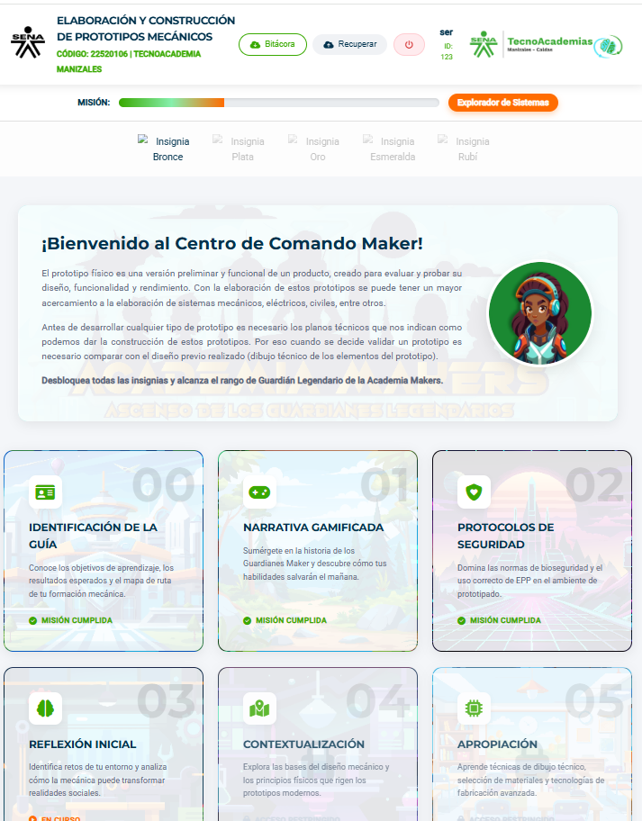

# 🛠️ Dashboard Maker - Elaboración de Prototipos Mecánicos

Bienvenido al **Centro de Comando Maker**, una plataforma educativa gamificada diseñada para la formación en ingeniería, dibujo técnico y construcción de prototipos mecánicos en la **TecnoAcademia Manizales - SENA**.

---

## 🚀 Acceso al Proyecto
Puedes visualizar la plataforma en vivo aquí:  
👉 **https://altarians05.github.io/Dashboard_Elaboracion_Prototipos_Meconicos_Guia3/**

---

## 📋 Descripción
Este proyecto es un entorno virtual que guía a los aprendices a través de 9 módulos de aprendizaje. Utiliza una narrativa de "Guardianes Maker" para incentivar el progreso mediante:
* **Sistema de Logros:** Desbloqueo de insignias (Bronce a Rubí).
* **Progreso Persistente:** Guardado automático en el navegador y descarga de bitácora en formato JSON.
* **Niveles de Experiencia:** Desde "Recluta Maker" hasta "Guardián Legendario".

## 🛠️ Tecnologías Utilizadas
* **HTML5:** Estructura semántica.
* **CSS3:** Diseño responsivo, variables personalizadas y animaciones avanzadas.
* **JavaScript (Vanilla):** Lógica de estados, persistencia en `localStorage`, y sistema de pirotecnia en `Canvas`.
* **FontAwesome:** Iconografía técnica.
* **Google Fonts:** Tipografías 'Montserrat' y 'Roboto'.

## 📁 Estructura del Repositorio
* `index.html`: Dashboard principal y Centro de Comando.
* `moduloX.html`: Módulos individuales de aprendizaje.
* `imagenes/`: Recursos visuales, fondos de los módulos e insignias.
* `js/` & `css/`: (Si los tienes separados) Lógica y estilos.

## 🎖️ Cómo usar la Bitácora
1. Realiza tus actividades en los módulos.
2. Al terminar, usa el botón **"Bitácora"** en el encabezado para descargar tu progreso.
3. Si cambias de equipo, usa el botón **"Recuperar"** y carga tu archivo `.json` para retomar donde quedaste.

---
📅 **Año:** 2026  
🏢 **Institución:** TecnoAcademia Manizales - SENA  
⚙️ **Línea:** Ingeniería y Diseño
